# Installing Compass in Claude Desktop

This guide walks through installing the Compass plugin in Claude Desktop, step by step. If you prefer the CLI, see the "Claude Code CLI" section in the main [README](../README.md#install--claude-code).

> **Disclaimer:** Compass is for informational purposes only to support conversations with your medical team. It does not constitute medical advice. All treatment decisions should be made in consultation with your treating physicians.

---

## Before you start

You need:

- Claude Desktop installed and signed in (any plan).
- A folder somewhere on your computer that Compass will use to store the patient's case files. A Google-Drive-Desktop-synced folder is recommended so the care team can share it, but any local folder works.

The whole process takes about two minutes.

---

## Step 1 — Open Claude Desktop

Launch Claude Desktop. You should see the home screen with the chat input.

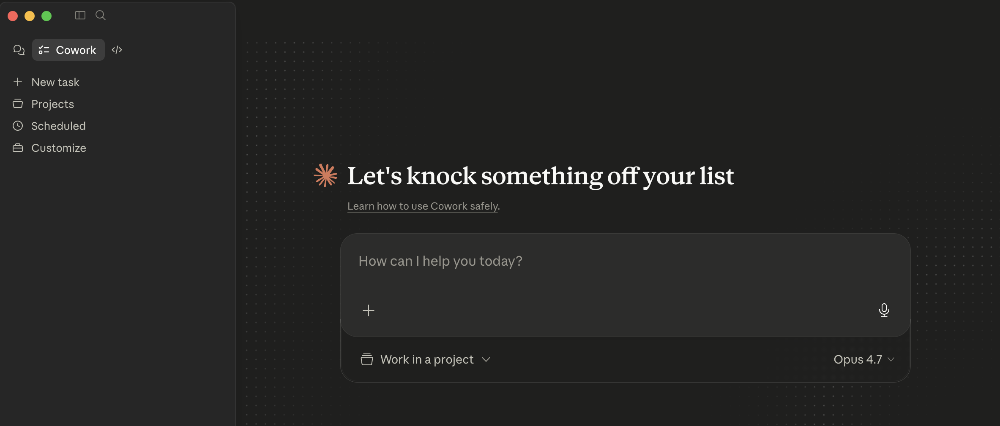

---

## Step 2 — Open Customize

In the left sidebar, click **Customize**.

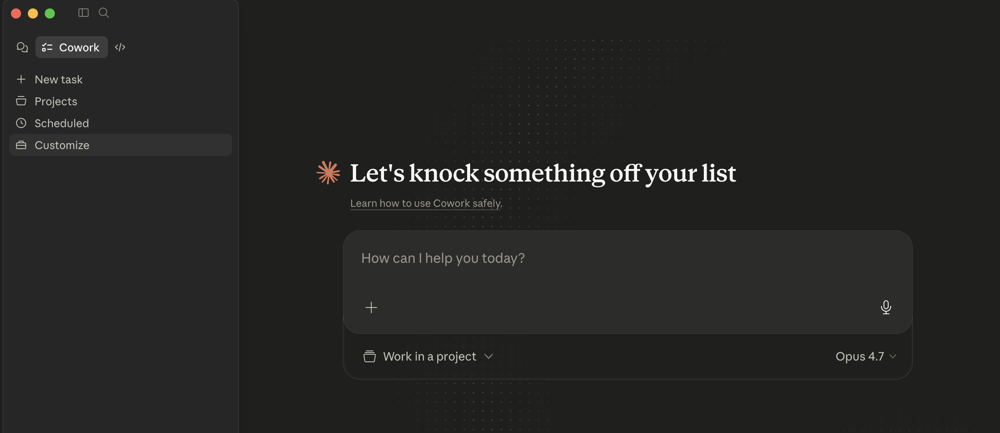

---

## Step 3 — Open the Add-plugin menu

On the Customize screen, find the **Personal plugins** section in the left rail. Click the **+** button next to "Personal plugins" (the tooltip reads "Add plugin").

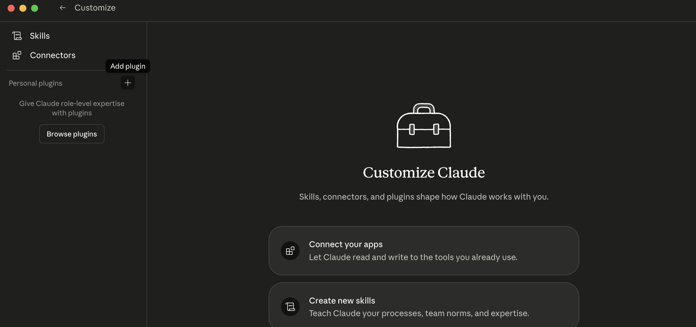

---

## Step 4 — Choose "Create plugin"

A small menu appears with two options. Hover over **Create plugin** to expand the submenu.

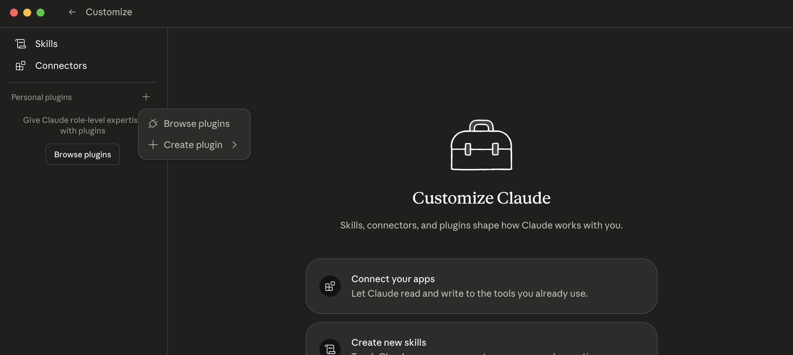

---

## Step 5 — Choose "Add marketplace"

In the expanded submenu, click **Add marketplace**. (Compass is installed via its marketplace entry, not as a direct plugin upload or a Claude-built plugin.)

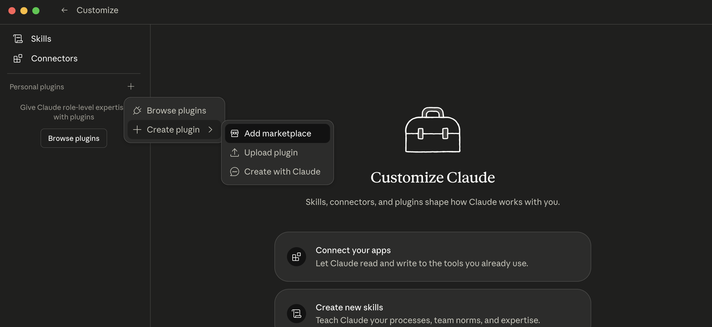

---

## Step 6 — The "Add marketplace" dialog opens

A dialog appears with a warning about trusting marketplaces and a URL field that accepts either `owner/repo` shorthand or a full git URL.

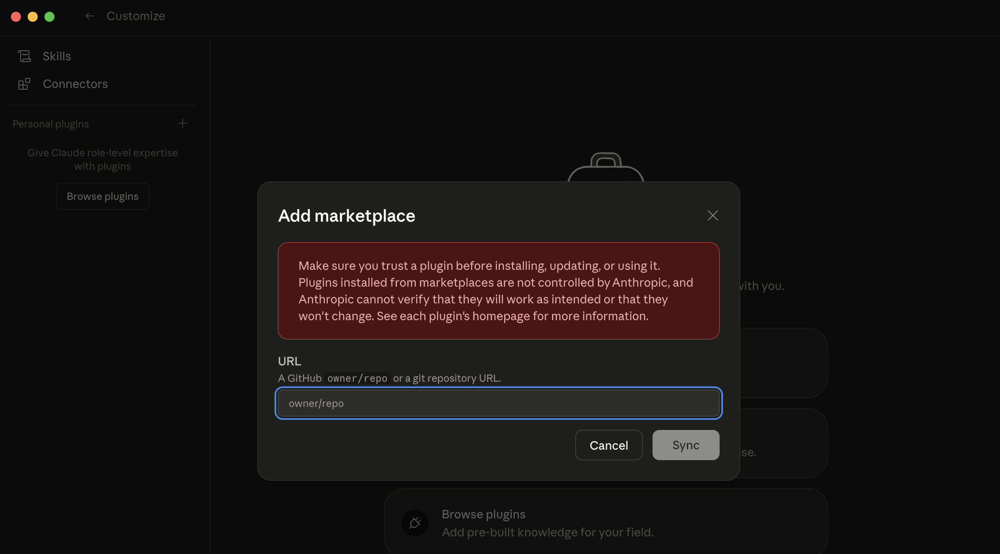

---

## Step 7 — Enter `jordajm/compass` and click Sync

Type `jordajm/compass` into the URL field, then click **Sync**.

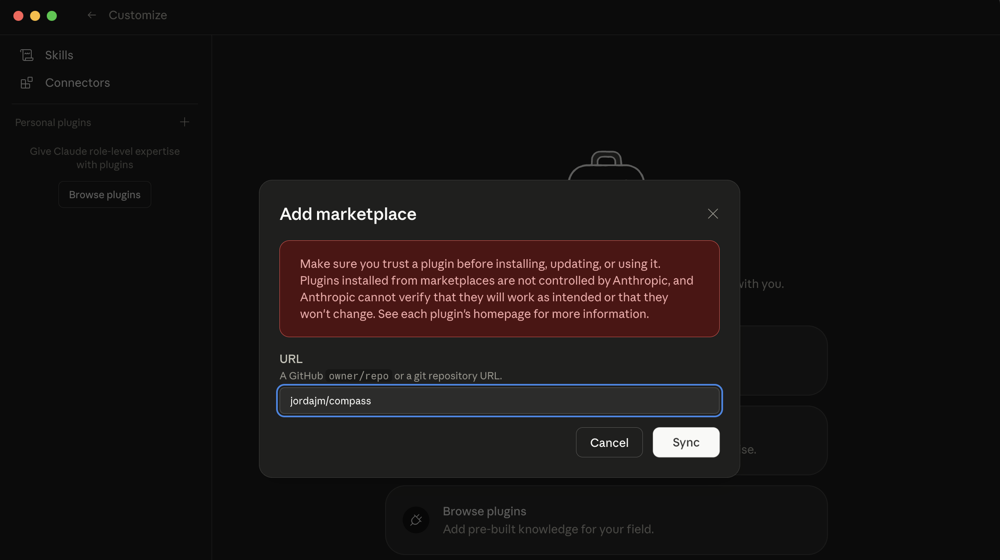

Claude Desktop fetches the marketplace. After a moment, the dialog closes and you land in the Directory view.

---

## Step 8 — Open the "Personal" tab

The Directory opens on the **Your organization** tab by default, which will likely be empty for most users.

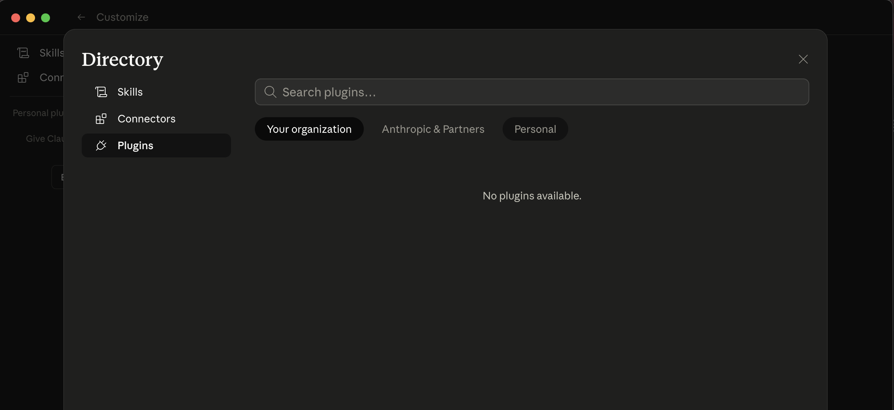

Click the **Personal** tab. You should now see a `compass` marketplace pill, and a **Compass** plugin card by John Jordan.

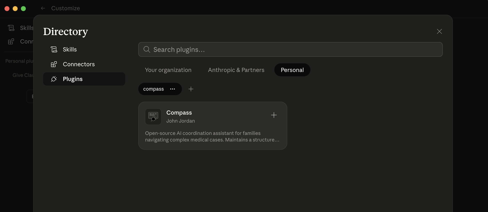

Click the **+** button on the Compass card to install the plugin.

---

## Step 9 — Confirm the install

After installation, the Compass plugin page opens. The toggle in the upper right is on, and you can see all of Compass's bundled skills and agents listed.

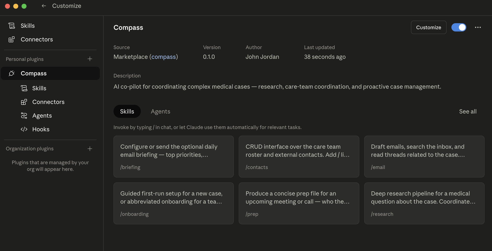

The skills you should see:

- `/briefing` — Configure or send the optional daily email briefing.
- `/contacts` — CRUD interface over the care team roster and external contacts.
- `/email` — Draft emails, search the inbox, read threads.
- `/onboarding` — Guided first-run setup for a new case.
- `/prep` — Concise prep file for an upcoming meeting or call.
- `/research` — Deep research pipeline for a medical question.

(Scroll down to see `/todo` and `/update` as well.)

---

## Step 10 — First run

Compass is now installed, but it has no case file yet. To set one up:

1. Decide where you want Compass to store the patient's case files. Create the folder if it does not exist. A Google-Drive-Desktop-synced folder is ideal because it syncs to anyone you share the folder with.
2. Open a new chat in Claude Desktop and select that folder as the working project. (Click **Work in a project** under the chat input on the home screen, then either pick an existing project pointing at the folder, or create a new project and point it at the folder.)
3. In the chat input, type `/compass`. The slash-command picker appears with every Compass skill listed. Hover over any item to see what it does.

   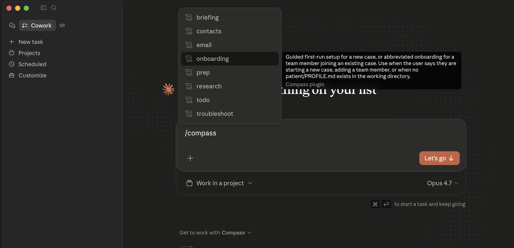

4. Click **onboarding** (or arrow-down to it and press Enter). The input now shows `/onboarding`, ready to send.

   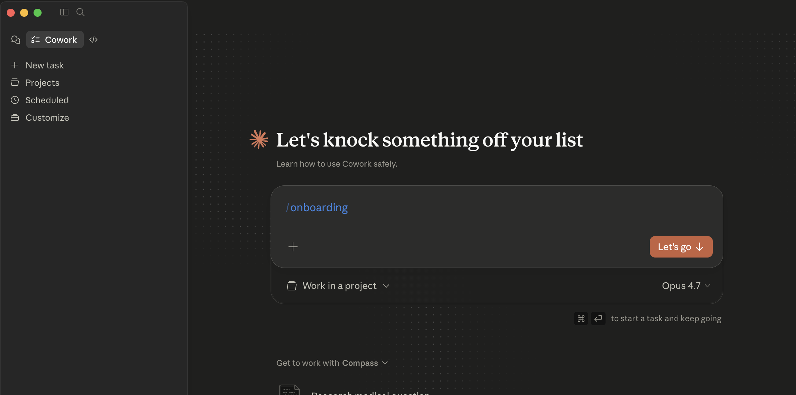

5. Click **Let's go** (or press ⌘↵) to run the skill.
6. Compass will detect this is a new case (no `patient/PROFILE.md` yet) and walk you through the rest: identifying you, setting up the patient profile, scaffolding the directory, and ingesting any medical documents you already have.

---

## Troubleshooting

- **The marketplace fails to sync.** Check that you typed `jordajm/compass` exactly, with the slash and no leading `@`. If the network is restricted, the plugin can also be installed via the CLI (see README).
- **The Compass card does not appear under Personal.** Refresh the Directory by closing and reopening it, or quit and relaunch Claude Desktop.
- **`/compass:` commands do not appear in the chat.** Make sure the toggle on the Compass plugin page is enabled (it should be on by default after install).
- **Compass complains it cannot find `patient/PROFILE.md`.** That file is created during `/compass:onboarding`. Run that skill once and it will be created in your case folder.
- **You need a deeper diagnosis.** Run `/compass:troubleshoot` — it checks your environment, plugin version, connectors, and case-folder state, and prints a fix-it report.
