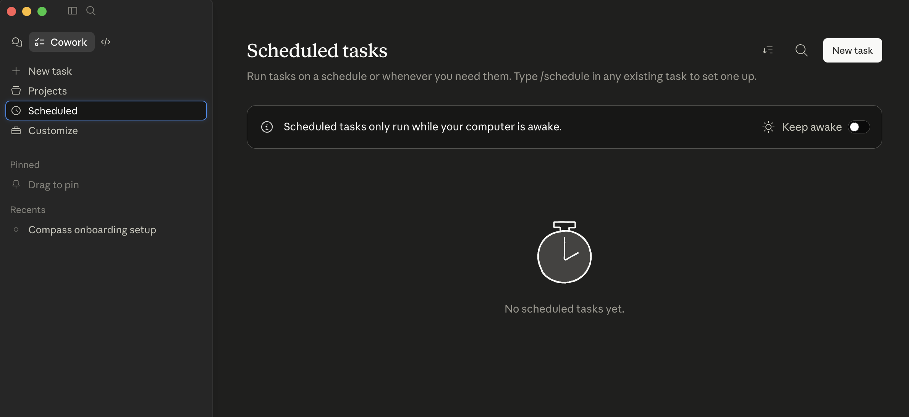
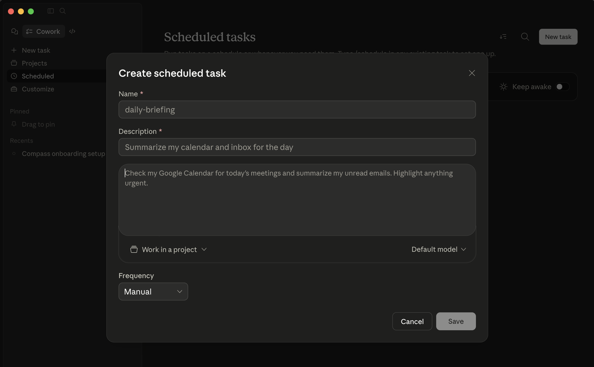
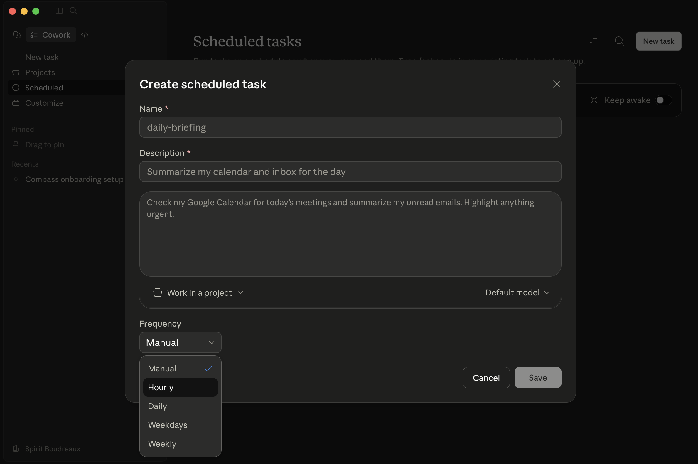
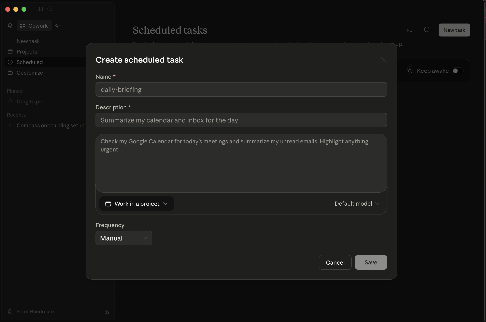

# Setting up a Compass Scheduled Task in Claude Cowork

This guide walks through creating a Claude Cowork **Scheduled task** that runs `/compass:update` hourly and drafts a daily email briefing when one is due. Compass generates a ready-to-paste prompt for you during `/compass:onboarding` — this guide shows where it goes.

> **Disclaimer:** Compass is for informational purposes only to support conversations with your medical team. It does not constitute medical advice. All treatment decisions should be made in consultation with your treating physicians.

---

## Before you start

You need:

- Claude Desktop with Cowork enabled and signed in.
- The Compass plugin installed and onboarded. If you haven't done that yet, see the [Claude Desktop install guide](install-claude-desktop.md) and run `/compass:onboarding` first.
- A Compass **project** set up in Claude Desktop (this is the "working project" that points at your case folder — `/compass:onboarding` walks you through creating one).
- The **prompt** Compass printed at the end of onboarding. If you lost it, re-run `/compass:onboarding` and skip to the scheduled-task step, or ask Compass: "Generate the scheduled-task prompt again."

The whole process takes about a minute.

---

## Step 1 — Open the Scheduled tasks pane

In Claude Cowork, click **Scheduled** in the left sidebar. You'll see any existing scheduled tasks, or an empty-state screen if this is your first one.

---

## Step 2 — Click "New task"

The **New task** button is in the top right of the Scheduled tasks page.

---

## Step 3 — Name the task and paste the Compass prompt

Give it a name (e.g., `compass-hourly`) and a short description. In the prompt field, paste the prompt Compass generated during onboarding — it's the long instruction block that tells Cowork what to do each hour.

---

## Step 4 — Select the Compass project

At the bottom of the dialog, click **Work in a project** and pick the Compass project you created during onboarding. This gives the scheduled run the same working-directory context as an interactive chat — without it, Cowork won't know where your case files live.

---

## Step 5 — Set the frequency to Hourly

Click the **Frequency** dropdown and choose **Hourly**. You can pick Daily, Weekdays, or Weekly if you'd prefer less frequent check-ins, but hourly is the default Compass recommends.

---

## Step 6 — Save

Click **Save**. The new task appears in your Scheduled tasks list and will start running at the top of the next hour.

---

## Step 7 — "Keep awake" if you care about overnight runs

Cowork only runs scheduled tasks while your computer is awake. On the Scheduled tasks page, the **Keep awake** toggle (top right) asks your Mac to stay awake during scheduled run windows. Flip it on if you want Compass to catch up overnight; leave it off if you'd rather just run when your computer is already in use.

---

## Troubleshooting

- **The task didn't run.** Cowork only runs scheduled tasks while your computer is awake. Check the Keep awake toggle, or check that the computer wasn't asleep at the scheduled time.
- **The run happened but nothing changed in the case folder.** Open the run in Cowork and look at the output — `/compass:update` will say "no new information since last run" when there's nothing to ingest. That's normal.
- **The run is failing with "no such project" or "can't find patient/PROFILE.md".** Edit the task and make sure **Work in a project** points at the Compass project, and that the project's folder path matches your case folder (the one `/compass:onboarding` set up).
- **I lost the prompt.** Run `/compass:onboarding` and skip to Step 9 (Scheduled updates), or ask Compass in an interactive chat: "Regenerate the scheduled-task prompt for Cowork."
- **Briefings aren't being drafted.** Check that Gmail (or your email connector) is still connected and that the briefing cadence in `config/briefing.md` is set. Run `/compass:briefing preview` interactively to see what would be sent.
